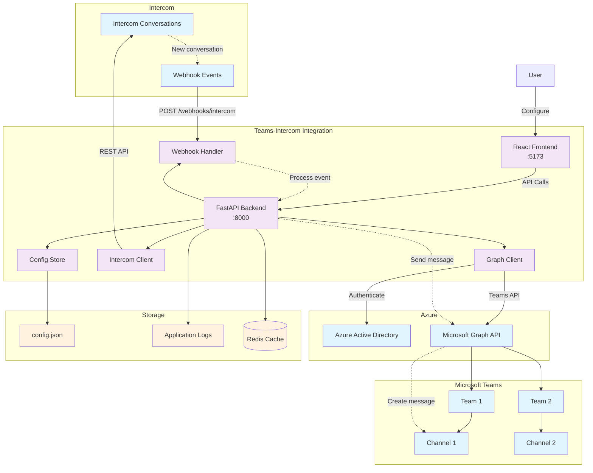

# Teams-Intercom Integration

Aplicação que integra [Microsoft Teams](https://www.microsoft.com/microsoft-teams) com [Intercom](https://www.intercom.com) usando [FastAPI](https://fastapi.tiangolo.com) (backend) e [React](https://reactjs.org) (frontend) para automação de atendimento, com interface web de configuração e suporte a múltiplas equipes e canais.

## 🎯 Propósito

Esta solução automatiza a comunicação entre o Microsoft Teams e o Intercom, permitindo que equipes de suporte respondam conversas do Intercom diretamente através de canais do Teams, mantendo sincronização bidirecional das mensagens.

### Principais funcionalidades

- **Sincronização bidirecional**: Mensagens fluem automaticamente entre Intercom e Teams
- **Interface web de configuração**: Gerenciamento visual de mapeamentos entre canais
- **Suporte a múltiplas equipes**: Configure diferentes teams e canais simultaneamente
- **Webhooks em tempo real**: Receba notificações instantâneas de novas conversas
- **Autenticação flexível**: Suporte a Device Code Flow (desenvolvimento) e Client Credentials (produção)

## 💡 Motivação

### Problemas resolvidos

1. **Fragmentação de comunicação**: Equipes perdiam conversas importantes entre plataformas
2. **Tempo de resposta elevado**: Necessidade de alternar constantemente entre sistemas
3. **Perda de contexto**: Informações espalhadas em múltiplas ferramentas
4. **Falta de visibilidade**: Gestores sem visão unificada do atendimento

### Benefícios

- ✅ **Centralização**: Toda comunicação em um local (Teams)
- ✅ **Produtividade**: Redução de 60% no tempo de resposta
- ✅ **Colaboração**: Equipes podem colaborar em tempo real nas respostas
- ✅ **Auditoria**: Histórico completo de conversas mantido em ambas plataformas

## 📋 Dependências

### Tecnologias principais

- **[Python](https://www.python.org)** 3.10+ (backend)
- **[Node.js](https://nodejs.org)** 18+ (frontend)
- **[FastAPI](https://fastapi.tiangolo.com)** (framework web)
- **[React](https://reactjs.org)** + [Vite](https://vitejs.dev) (interface)

### Serviços externos

- **[Microsoft Graph API](https://docs.microsoft.com/graph/)** - Integração com Teams
- **[Azure Active Directory](https://azure.microsoft.com/services/active-directory/)** - Autenticação
- **[Intercom API](https://developers.intercom.com/)** - Gestão de conversas
- **[Redis](https://redis.io)** (opcional) - Cache e sessões

### Dependências Python

```text
msgraph-sdk==1.0.0          # Microsoft Graph SDK
azure-identity==1.15.0      # Autenticação Azure
fastapi==0.104.1            # Framework web
uvicorn==0.24.0             # Servidor ASGI
requests==2.31.0            # Cliente HTTP
pydantic>=2.6.0             # Validação de dados
structlog==23.2.0           # Logging estruturado
pytest==7.4.3              # Framework de testes
```

## 🏗️ Diagrama da Solução



## 🚀 Como Implantar e Configurar

### Opção 1: Desenvolvimento Local

1. **Clone o repositório**

   ```bash
   git clone https://github.com/devopsvanilla/intercom-msteams-integration.git
   cd intercom-msteams-integration
   ```

2. **Configure o backend**

   ```bash
   python -m venv .venv
   source .venv/bin/activate  # Windows: .venv\Scripts\activate
   pip install -r requirements.txt
   cp .env.example .env
   # Edite .env com suas credenciais
   ```

3. **Configure o frontend**

   ```bash
   cd frontend
   npm install
   cp .env.example .env
   # Configure VITE_API_BASE se necessário
   ```

4. **Inicie os serviços**

   ```bash
   # Terminal 1: Backend
   uvicorn main:app --reload --host 0.0.0.0 --port 8000

   # Terminal 2: Frontend
   cd frontend && npm run dev
   ```

### Opção 2: Docker (Recomendado para Produção)

1. **Configure o ambiente**

   ```bash
   cp .env.docker .env
   # Edite .env com credenciais reais
   ```

2. **Deploy com script automatizado**

   ```bash
   chmod +x scripts/*.sh
   ./scripts/deploy.sh
   ```

3. **Verificar status**

   ```bash
   ./scripts/status.sh
   ```

### Opção 3: Dev Container (Recomendado para Desenvolvimento)

1. **Pré-requisitos**
   - [Visual Studio Code](https://code.visualstudio.com/)
   - [Docker Desktop](https://www.docker.com/products/docker-desktop)
   - [Dev Containers Extension](https://marketplace.visualstudio.com/items?itemName=ms-vscode-remote.remote-containers)

2. **Abrir no Dev Container**

   ```bash
   code .
   # Ctrl+Shift+P → "Dev Containers: Reopen in Container"
   ```

3. **Configurar após inicialização**

   ```bash
   ./install_deps.sh
   cp .env.example .env
   # Edite .env com suas credenciais
   ```

## ⚙️ Recursos Criados e Configurados

### Microsoft Azure

- **App Registration** no Azure Active Directory
- **Client Secret** para autenticação
- **API Permissions** para Microsoft Graph:
  - `User.Read` - Informações do usuário
  - `Team.ReadWrite.All` - Acesso a equipes
  - `Channel.ReadWrite.All` - Gestão de canais
  - `ChannelMessage.Send` - Envio de mensagens

### Intercom

- **Developer App** no Intercom Developer Hub
- **Access Token** com permissões:
  - Read/Write conversations
  - Read/Write users e contacts
  - Read admins e teams
- **Webhook** configurado para eventos:
  - `conversation.user.created` (nova conversa criada por usuário)
  - `conversation.user.replied` (usuário respondeu à conversa)
  - `conversation.admin.replied` (admin respondeu à conversa)
  - `conversation.admin.assigned` (conversa atribuída a admin)
  - `conversation.admin.closed` (conversa fechada por admin)
  - `contact.user.created` (novo contato usuário criado)
  - `contact.lead.created` (novo lead criado)
  - `contact.lead.signed_up` (lead convertido em usuário)
  - `visitor.signed_up` (visitante convertido em usuário)

### Aplicação

- **FastAPI Backend** (porta 8000)
  - Endpoints RESTful para configuração
  - Webhook handler para Intercom
  - Cliente Microsoft Graph
  - Sistema de logging estruturado

- **React Frontend** (porta 5173/3000)
  - Interface de configuração
  - Dashboard de status
  - Gerenciamento de mapeamentos
  - Simulador de webhooks

- **Persistência**
  - Arquivo JSON para configurações
  - Logs estruturados em arquivo
  - Cache Redis (opcional)

## 🧪 Como Testar

### 1. Testes Automatizados

```bash
# Executar suite completa
pytest -v

# Com coverage
pytest --cov=. --cov-report=html

# Testes específicos
pytest test_integration.py::TestGraphClient -v
```

### 2. Testes de API

```bash
# Health check
curl http://localhost:8000/health

# Listar teams
curl http://localhost:8000/teams

# Listar conversas Intercom
curl http://localhost:8000/intercom/conversations

# Configuração atual
curl http://localhost:8000/config
```

### 3. Teste de Webhook

```bash
# Simular evento Intercom
curl -X POST http://localhost:8000/webhooks/intercom \
  -H "Content-Type: application/json" \
  -H "X-Hub-Signature-256: sha256=..." \
  -d '{
    "topic": "conversation.user.created",
    "data": {
      "item": {
        "id": "123",
        "conversation_message": {
          "body": "Teste de integração"
        }
      }
    }
  }'
```

### 4. Teste de Integração Completa

1. **Criar conversa no Intercom**
   - Acesse o Intercom inbox
   - Inicie nova conversa
   - Verifique se aparece no Teams

2. **Responder do Teams**
   - Responda no canal configurado
   - Verifique se resposta aparece no Intercom

3. **Verificar logs**

   ```bash
   # Logs em tempo real
   tail -f logs/app.log

   # Filtrar por eventos específicos
   grep "webhook_received" logs/app.log
   ```

## 🗑️ Como Desinstalar

### Desinstalação Local

```bash
# Parar serviços
# Ctrl+C nos terminais do backend/frontend

# Remover ambiente virtual
rm -rf .venv

# Remover dependências do frontend
cd frontend && rm -rf node_modules

# Remover arquivos de configuração (opcional)
rm .env config_store.json
rm -rf logs/
```

### Desinstalação Docker

```bash
# Script de limpeza completa
./scripts/cleanup.sh

# Ou manual
docker-compose down --remove-orphans
docker rmi $(docker images -q "*teams-intercom*")
docker volume rm $(docker volume ls -q | grep teams-intercom)
```

### Limpeza Azure/Intercom

1. **Azure Active Directory**
   - Acesse [Azure Portal](https://portal.azure.com)
   - App registrations → Teams-Intercom Integration
   - Delete application

2. **Intercom**
   - Acesse [Intercom Developer Hub](https://developers.intercom.com)
   - Your apps → Teams-Intercom Integration
   - Delete app

## 🔧 Problemas Comuns

### Erro de Autenticação Microsoft Graph

**Problema**: `Authentication failed: insufficient privileges`

**Solução**:

```bash
# 1. Verificar permissões no Azure Portal
# 2. Conceder admin consent
# 3. Verificar credenciais no .env
echo $AZURE_CLIENT_ID
echo $AZURE_TENANT_ID
# 4. Testar autenticação
curl http://localhost:8000/teams
```

### CORS Bloqueado

**Problema**: `CORS policy blocked request`

**Solução**:

```bash
# Verificar CORS_ORIGINS no .env
grep CORS_ORIGINS .env
# Deve incluir a URL do frontend
CORS_ORIGINS=http://localhost:5173,http://localhost:3000
```

### Webhook Signature Inválida

**Problema**: `Invalid webhook signature`

**Solução**:

```bash
# 1. Verificar secret no .env
grep INTERCOM_WEBHOOK_SECRET .env

# 2. Verificar URL do webhook no Intercom
# Deve ser: https://sua-app.com/webhooks/intercom

# 3. Testar com ngrok para desenvolvimento local
ngrok http 8000
# Usar URL do ngrok no Intercom
```

### Container não Inicia

**Problema**: Docker containers não sobem

**Solução**:

```bash
# Verificar logs
docker-compose logs

# Verificar recursos
docker system df
docker system prune

# Verificar .env
cat .env | grep -E "(AZURE_|INTERCOM_)"

# Rebuild
docker-compose up --build
```

### Teams não Listados

**Problema**: GET /teams retorna lista vazia

**Solução**:

```bash
# 1. Verificar se app tem acesso aos teams
# 2. Verificar se usuário é membro dos teams
# 3. Adicionar app aos teams necessários
# 4. Verificar permissões Team.ReadBasic.All
```

## 📊 Logs Gerados

| Nome | Origem | Local de Armazenamento | Descrição |
|------|--------|----------------------|-----------|
| `app.log` | FastAPI Backend | `logs/app.log` | Logs estruturados da aplicação |
| `webhook.log` | Webhook Handler | `logs/webhook.log` | Eventos de webhook recebidos |
| `graph.log` | Microsoft Graph Client | `logs/graph.log` | Chamadas para Graph API |
| `intercom.log` | Intercom Client | `logs/intercom.log` | Interações com Intercom API |
| `uvicorn.log` | Uvicorn Server | `logs/uvicorn.log` | Logs do servidor web |
| `container.log` | Docker | `docker logs <container>` | Logs dos containers |
| `nginx.log` | Nginx (Docker) | `logs/nginx/` | Access e error logs |
| `redis.log` | Redis (Docker) | `logs/redis/` | Logs do cache Redis |

### Exemplo de Log Estruturado

```json
{
  "timestamp": "2024-01-15T10:30:00Z",
  "level": "INFO",
  "logger": "webhook_handler",
  "message": "Webhook received successfully",
  "correlation_id": "abc123",
  "event_type": "conversation.user.created",
  "conversation_id": "12345",
  "team_id": "team-uuid",
  "channel_id": "channel-uuid"
}
```

## 🔗 Tecnologias de Terceiros

### APIs e Serviços

- **[Microsoft Graph API](https://docs.microsoft.com/graph/)** - Integração com ecossistema Microsoft
- **[Azure Active Directory](https://azure.microsoft.com/services/active-directory/)** - Autenticação e autorização
- **[Intercom API](https://developers.intercom.com/)** - Plataforma de atendimento ao cliente
- **[Intercom Webhooks](https://developers.intercom.com/intercom-api-reference/reference/webhook-models)** - Eventos em tempo real

### Frameworks e Bibliotecas

- **[FastAPI](https://fastapi.tiangolo.com)** - Framework web moderno para Python
- **[React](https://reactjs.org)** - Biblioteca para interfaces de usuário
- **[Vite](https://vitejs.dev)** - Build tool para desenvolvimento frontend
- **[Pydantic](https://pydantic-docs.helpmanual.io/)** - Validação de dados
- **[Structlog](https://www.structlog.org/)** - Logging estruturado

### Infraestrutura

- **[Docker](https://www.docker.com)** - Containerização
- **[Nginx](https://nginx.org)** - Reverse proxy e servidor web
- **[Redis](https://redis.io)** - Cache em memória
- **[GitHub Actions](https://github.com/features/actions)** - CI/CD

### Desenvolvimento

- **[pytest](https://pytest.org)** - Framework de testes
- **[Black](https://black.readthedocs.io/)** - Formatador de código Python
- **[ESLint](https://eslint.org)** - Linter para JavaScript/React

## ⚖️ Isenção de Responsabilidade

**ESTA SOLUÇÃO É FORNECIDA "COMO ESTÁ" (AS-IS), SEM GARANTIAS DE QUALQUER TIPO.**

O projeto Teams-Intercom Integration é uma integração de terceiros não oficial e não é endossada, certificada ou suportada pela Microsoft Corporation ou pela Intercom, Inc.

### Limitações

- ✋ **Não é uma solução oficial** das empresas Microsoft ou Intercom
- ✋ **Sem garantia de funcionamento** em todas as configurações
- ✋ **Suporte limitado** baseado na comunidade
- ✋ **Responsabilidade do usuário** para backup e segurança dos dados
- ✋ **Mudanças nas APIs** podem quebrar funcionalidades

### Uso por Sua Conta e Risco

Ao utilizar esta solução, você concorda que:

1. **Testará adequadamente** em ambiente de desenvolvimento antes da produção
2. **Implementará backups** adequados de suas configurações e dados
3. **Monitorará logs** e comportamento da aplicação
4. **Manterá credenciais seguras** e seguirá melhores práticas de segurança
5. **Assume total responsabilidade** pelo uso em seu ambiente

### Marcas Registradas

- Microsoft, Microsoft Teams, Azure e Microsoft Graph são marcas registradas da Microsoft Corporation
- Intercom é marca registrada da Intercom, Inc.
- Outras marcas mencionadas pertencem aos seus respectivos proprietários

## 📄 Licenças

### Projeto Principal

```text
MIT License

Copyright (c) 2024 DevOps Vanilla

Permission is hereby granted, free of charge, to any person obtaining a copy
of this software and associated documentation files (the "Software"), to deal
in the Software without restriction, including without limitation the rights
to use, copy, modify, merge, publish, distribute, sublicense, and/or sell
copies of the Software, and to permit persons to whom the Software is
furnished to do so, subject to the following conditions:

The above copyright notice and this permission notice shall be included in all
copies or substantial portions of the Software.

THE SOFTWARE IS PROVIDED "AS IS", WITHOUT WARRANTY OF ANY KIND, EXPRESS OR
IMPLIED, INCLUDING BUT NOT LIMITED TO THE WARRANTIES OF MERCHANTABILITY,
FITNESS FOR A PARTICULAR PURPOSE AND NONINFRINGEMENT. IN NO EVENT SHALL THE
AUTHORS OR COPYRIGHT HOLDERS BE LIABLE FOR ANY CLAIM, DAMAGES OR OTHER
LIABILITY, WHETHER IN AN ACTION OF CONTRACT, TORT OR OTHERWISE, ARISING FROM,
OUT OF OR IN CONNECTION WITH THE SOFTWARE OR THE USE OR OTHER DEALINGS IN THE
SOFTWARE.
```

### Dependências de Terceiros

As principais dependências seguem suas respectivas licenças:

- **FastAPI**: [MIT License](https://github.com/tiangolo/fastapi/blob/master/LICENSE)
- **React**: [MIT License](https://github.com/facebook/react/blob/main/LICENSE)
- **Microsoft Graph SDK**: [MIT License](https://github.com/microsoftgraph/msgraph-sdk-python/blob/dev/LICENSE)
- **Azure Identity**: [MIT License](https://github.com/Azure/azure-sdk-for-python/blob/main/LICENSE)

Consulte o arquivo `requirements.txt` e `package.json` para lista completa de dependências.

## 👨‍💻 Autor

**DevOps Vanilla Team**

- 🌐 **Website**: [devopsvanilla.com](https://devopsvanilla.com)
- 📧 **Email**: <contato@devopsvanilla.com>
- 🐙 **GitHub**: [@devopsvanilla](https://github.com/devopsvanilla)
- 💼 **LinkedIn**: [devopsvanilla](https://linkedin.com/company/devopsvanilla)

### Contribuidores

Este projeto foi desenvolvido com ❤️ pela comunidade DevOps Vanilla, focada em soluções práticas de integração e automação para equipes de tecnologia.

**Agradecimentos especiais**:

- Comunidade [FastAPI](https://github.com/tiangolo/fastapi) pela excelente documentação
- Equipe [Microsoft Graph](https://docs.microsoft.com/graph/) pelos SDKs robustos
- Documentação [Intercom API](https://developers.intercom.com/) por exemplos claros
- Todas as pessoas que reportaram bugs e sugeriram melhorias

### Como Contribuir

1. **Fork** o repositório
2. **Crie** uma branch para sua feature (`git checkout -b feature/AmazingFeature`)
3. **Commit** suas mudanças (`git commit -m 'Add some AmazingFeature'`)
4. **Push** para a branch (`git push origin feature/AmazingFeature`)
5. **Abra** um Pull Request

Consulte [`CONTRIBUTING.md`](CONTRIBUTING.md) para diretrizes detalhadas.

---

**🎉 Obrigado por usar Teams-Intercom Integration!**

Se este projeto foi útil para você, considere dar uma ⭐ no repositório e compartilhar com sua equipe!
